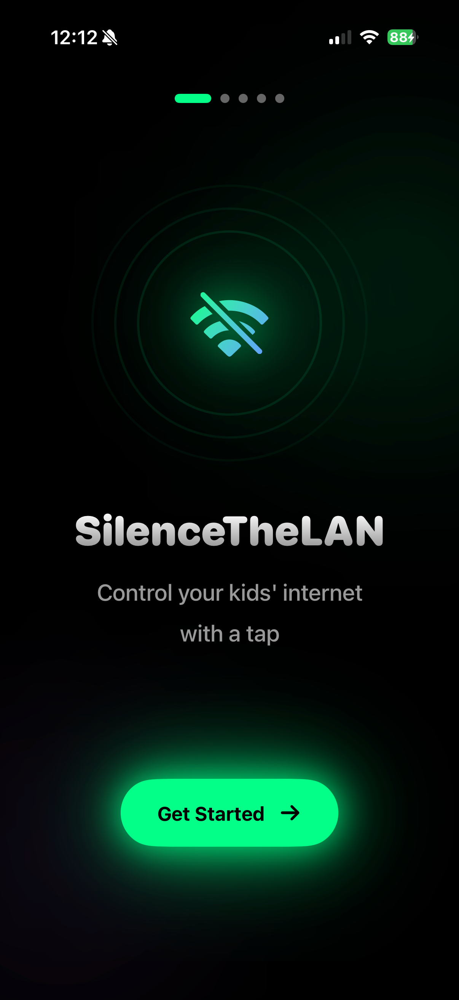
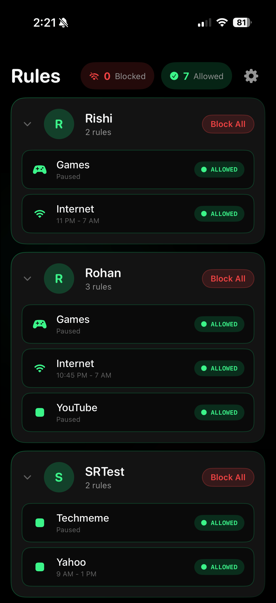
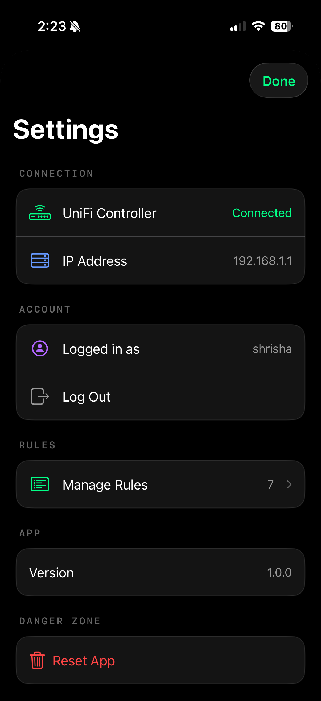
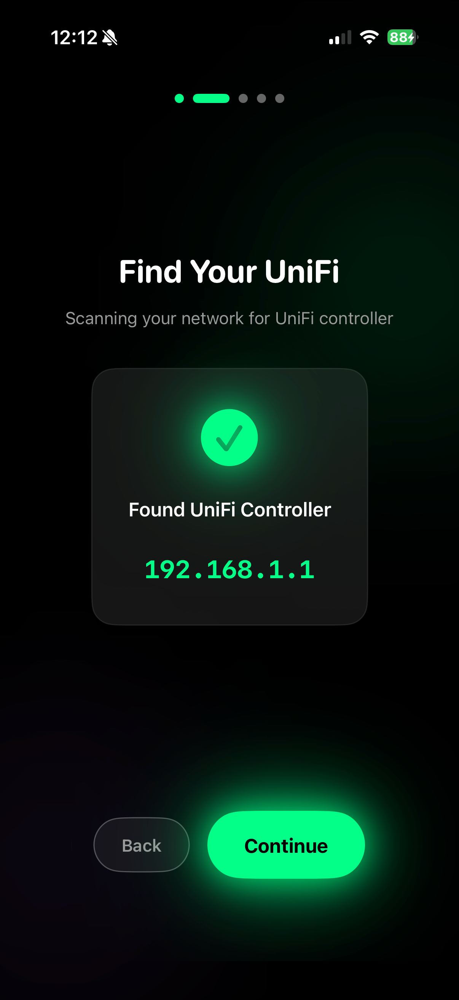
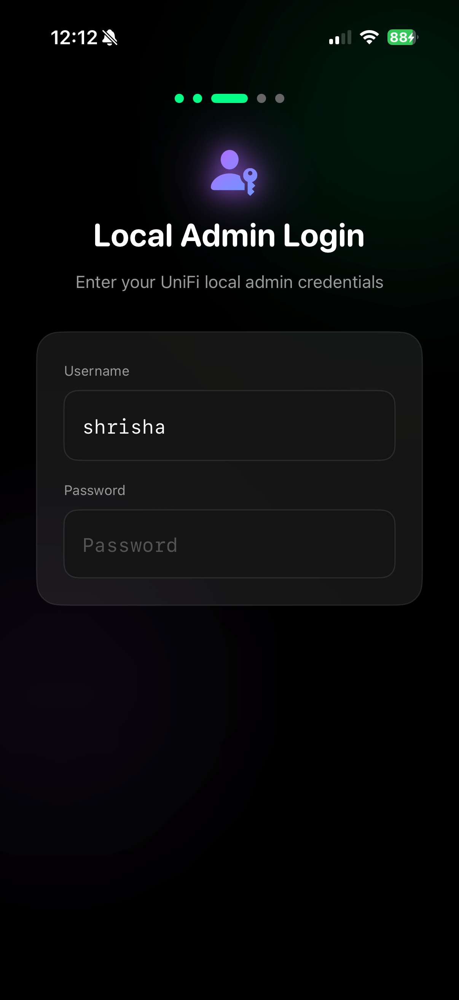

# SilenceTheLAN

**Control your kids' internet with a tap.**

A simple iOS app for parents with UniFi networks. Set up your firewall rules once in UniFi, then use this app to toggle them on/off without touching the UniFi interface.

<p align="center">
  
  
  
</p>

## Why This Exists

I tried Circle, Bark, built-in screen time, and various router solutions. They all fell short - kids found workarounds, the apps were clunky, or they didn't give me the control I needed.

UniFi's firewall rules are incredibly powerful, but:
- The UI is buried in settings
- It's easy to mess something up
- You don't want to hand your phone to your spouse and say "navigate to Settings > Security > Firewall Rules..."

**SilenceTheLAN** lets you set up rules once (the hard part), then toggle them with one tap (the daily part).

## Features

- **One-tap control** - Block or allow internet instantly
- **Grouped by person** - See all rules for each family member together
- **Schedule-aware** - Shows normal schedule times, preserves them when you override
- **Siri Shortcuts** - "Block Rishi in SilenceTheLAN"
- **Local only** - No cloud, no accounts, everything stays on your network

## Requirements

- **iOS 17.0+**
- **UniFi Dream Machine** (UDM, UDM Pro, UDM SE) or **Cloud Gateway** (UCG Max, UCG Ultra)
- iPhone on the **same local network** as your UniFi controller
- A **local UniFi admin account** (not cloud/SSO - see setup below)

## Quick Start

### 1. Create firewall rules in UniFi

In UniFi Console → Settings → Security → Firewall Rules, create rules with:
- **Name** starting with `Downtime-` (e.g., `Downtime-Rishi`, `Downtime-Rishi-Games`)
- **Action** set to `Block`
- **Schedule** for your normal blocking hours

The app groups rules by the name after "Downtime-":

| Rule Name | Shows As |
|-----------|----------|
| `Downtime-Rishi` | Rishi → Internet |
| `Downtime-Rishi-Games` | Rishi → Games |
| `Downtime-Rohan-YouTube` | Rohan → YouTube |

### 2. Create a local admin account

In UniFi Console → Settings → Admins & Users:
- Create a new admin with **Local Access Only**
- Cloud/SSO accounts with 2FA won't work

### 3. Install and connect

1. Build from source or install via TestFlight (coming soon)
2. App auto-discovers your UniFi controller
3. Log in with your local admin account
4. Select which rules to manage
5. Done!

<p align="center">
  
  
</p>

## How It Works

The app doesn't create or delete rules - it only toggles existing ones. This is intentional:

- **Tap when allowed** → Blocks immediately (sets schedule to "Always")
- **Tap when blocked** → Allows traffic (pauses the rule or restores schedule)

Your original schedule is preserved and restored when you toggle back.

## Building from Source

```bash
git clone https://github.com/shrisha/SilenceTheLAN.git
cd SilenceTheLAN
open SilenceTheLAN.xcodeproj
```

Build and run on your device (simulator won't be able to reach your UniFi controller).

## Limitations

- **Local network only** - No remote access (your UniFi controller isn't exposed to the internet, and neither is this app)
- **Local accounts only** - Cloud/SSO with 2FA not supported
- **iOS only** - No Android version (PRs welcome!)
- **Read-only rule management** - Cannot create/delete rules, only toggle them

## License

MIT License - See [LICENSE](LICENSE) for details.

## Contributing

Issues and PRs welcome! This is a personal project solving my own problem, but happy to make it useful for others.

## Acknowledgments

- Built with SwiftUI and SwiftData
- UniFi and UniFi Network Application are trademarks of Ubiquiti Inc.
